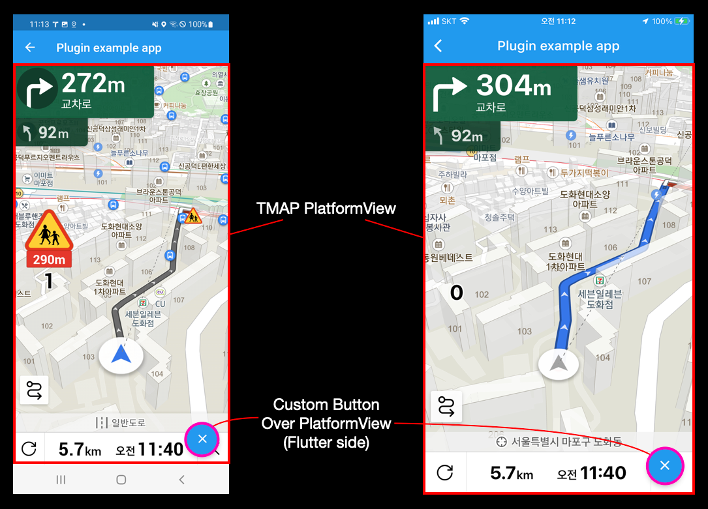

# tmap_ui_sdk
Flutter에서 TmapUISDK를 사용하기 위한 plugin입니다.   
이를 이용하여 복잡한 처리 없이 Tmap의 기능을 이용할 수 있습니다.   

## Getting Started
TmapUISDK는 인증정보를 입력받아 초기화를 진행한 뒤,   
주행안내와 관련된 기능을 수행할 수 있습니다.   
제공되는 Class 및 API에 대한 설명은 [dart doc](https://dart.dev/tools/dart-doc)을 이용하여 생성하실 수 있습니다.

다음은 TmapUISDK를 Fllutter에서 이용하기 위한 설명입니다.   
Flutter와 Android/iOS를 나누어 설명합니다.   

# Flutter
*  tmap_ui_sdk의 dependency를 pubspec.yaml에 설정합니다.
<pre><code>
dependencies:
...
	tmap_ui_sdk:
		git:
			url: https://github.com/TmapSDK/TmapUI_FlutterSDK.git
			ref: 1.0.0 # version. git tag name
...
</code></pre>
  

* OS별 plugin을 지원하기 위한 class를 설정합니다.
	* Tmap UISDK는 method channel과 event channel을 지원합니다.
<pre><code>
flutter:
	plugin:
		platforms:
			android:
				package: com.tmapmobility.tmap.tmapsdk.flutter.tmap_ui_sdk
				pluginClass: TmapUiSdkPlugin
			ios:
				pluginClass: TmapUiSdkPlugin
</code></pre>
  

# Android
Android의 지원을 위해선 다음의 내용을 추가합니다.

*  plugin의 참조를 위한 maven 추가
android/build.gradle의 repository에 다음을 추가합니다.
<pre><code>
...
allprojects {
    repositories {
        google()
        mavenCentral()
        // Tmap의 repository 추가
        maven {
            url = "https://devrepo.tmapadmin.com/repository/tmap-sdk-release/"
        }
    }
}
...
</code></pre>
  

* minimun SDK version의 설정
	* TmapUISDK는 SDK version 24부터 지원을 합니다.
	* 따라서 app/build.gradle의 minSdkVersion을 다음과 같이 지정합니다.
<pre><code>
    defaultConfig {
	...
        minSdkVersion 24
	...
    }
</code></pre>
  

* dataBinding
	* TmapUISDK는 databinding을 사용하므로 app/build.gradle에 다음을 추가합니다.
<pre><code>
android {
...
	dataBinding {
		enabled = true
	 }
}
</code></pre>
  

* MainActivity의 변경
	* TmapUISDK는 fragment를 이용하여 화면을 표시합니다.
	* 이를 위해선 MainActivity를 다음과 같이 FlutterFragmentActivity로 바꿔야 합니다.
<pre><code>
import io.flutter.embedding.engine.FlutterEngine
import io.flutter.embedding.android.FlutterFragmentActivity
import io.flutter.plugins.GeneratedPluginRegistrant
class MainActivity: FlutterFragmentActivity() {
	override fun configureFlutterEngine(flutterengine: FlutterEngine) {
		GeneratedPluginRegistrant.registerWith(flutterengine)
	}
}
</code></pre>
  

* AndroidMenifest.xml의 수정
	* TmapUISDK는 내부적으로 여러 모듈로 이루어져 있어 tools.replace를 이용하여 label을 변경할 수 있도록 추가합니다.
	* Material Design을 사용하고 있으므로 app의 theme을 MaterialComponents를 이용할 수 있도록 조정합니다.
<pre><code>
&lt;manifest xmlns:android="http://schemas.android.com/apk/res/android"
    xmlns:tools="http://schemas.android.com/tools" // 추가된 부분
    package="com.example.flutter_sdk_import_test">
   &lt;application
        android:label="flutter_sdk_import_test"
        tools:replace="android:label" // 추가된 부분
        android:name="${applicationName}"
        android:icon="@mipmap/ic_launcher">
        &lt;activity 
            android:name=".MainActivity"
            android:exported="true"
            android:launchMode="singleTop"
            android:theme="@style/Theme.MaterialComponents.NoActionBar.Bridge" // 수정된 부분
        ...
</code></pre>
  

# iOS
arm64 simulator는 현재 지원하지 않습니다. (M1 Mac을 이용하는 경우 주의)
  
* iOS version설정
	* TmapUISDK는 combine을 지원하므로 최소 ios 13.0 이상이어야 합니다.
	* Podfile에 최소 iOS version을 지정합니다.
<pre><code>
platform :ios, '13.0'
</code></pre>
  

* plugin 참조를 위한 source 지정
	* Podfile에 iOS의 SDK가 배포되는 source를 지정합니다.
<pre><code>
source 'https://github.com/TmapSDK/iosSDK.git'
source 'https://github.com/CocoaPods/Specs.git'
</code></pre>
  

* Compile option 지정
	* SDK내부에서 참조하는 3rdparty library를 정상적으로 Runtime에 link하기 위하여, BUILD_LIBRARY_FOR_DISTRIBUTION를 YES로 설정합니다.
    * 권한 확인을 위하여 사용하는 permission_handler의 위치권한을 활성화 하기 위한 macro를 설정합니다. (PERMISSION_LOCATION=1)
    * iOS의 target을 13.0으로 변경합니다.
<pre><code>
post_install do |installer|
	installer.pods_project.targets.each do |target|
		# SDK와 dependency가 있는 pod의 link를 위하여 추가
		target.build_configurations.each do |config|
			config.build_settings['BUILD_LIBRARY_FOR_DISTRIBUTION'] = 'YES'
		end
		flutter_additional_ios_build_settings(target)
		# To use package:permission_handler in dart. ref: https://pub.dev/packages/permission_handler
		target.build_configurations.each do |config|
			config.build_settings['GCC_PREPROCESSOR_DEFINITIONS'] ||= [
			'$(inherited)',
			'PERMISSION_LOCATION=1', 
			]
		end
	end
...
	installer.generated_projects.each do |project|
		project.targets.each do |target|
			target.build_configurations.each do |config|
				config.build_settings['IPHONEOS_DEPLOYMENT_TARGET'] = '13.0'
			 end
		end
	end
end
</code></pre>
  

* Device에 실행을 위해 보유한 Apple Developer 계정에 따라 Runner의 sign 설정을 수행합니다. 
  

* 위치권한 추가
	* TmapUISDK는 app사용중의 위치획득 권한이 필요합니다.
	* 따라서 info.plist에 다음의 내용을 추가합니다.
<pre><code>
&lt;plist version="1.0">
&lt;dict>
...
	&lt;key>NSLocationWhenInUseUsageDescription&lt;/key>
	&lt;string>위치권한 필수&lt;/string>
...
&lt;/dict>
&lt;/plist>
</code></pre>